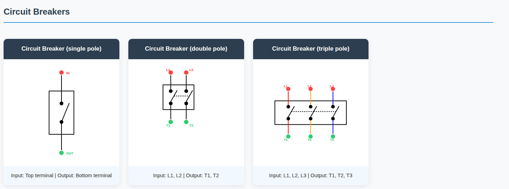
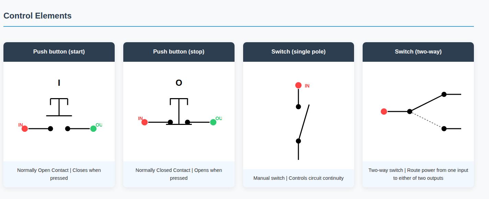
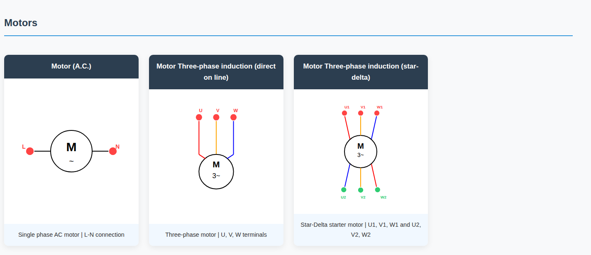
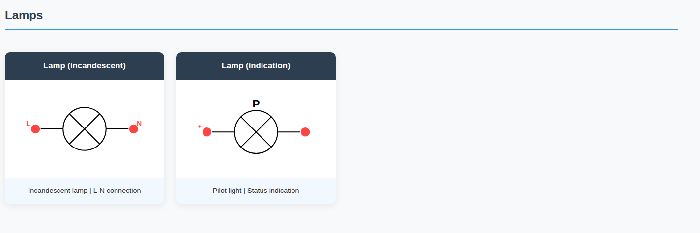

# Electrical Symbols Library

A web-based library showcasing **electrical schematic symbols** that comply with South African standards (SANS) and common international conventions.  
This project provides a visual reference for engineers, electricians, students, and hobbyists working with electrical diagrams.

## Live Demo
View the project here: [Electrical Symbols Preview](https://levii17.github.io/symbol-library/)

## Overview
The **Electrical Symbols Preview** is designed to:
- Provide a **quick visual reference** for common electrical symbols.
- Help ensure **consistency and compliance** in schematic drawings.
- Serve as a **foundation** for future tools, such as an interactive schematic drawing web app.

## Features
- **Categorized symbol library** for easy navigation:
  - Circuit Breakers
  - Isolators
  - Control Elements
  - Coils & Contactors
  - Relays
  - Motors
  - Wires & Connections
  - Measurement Instruments
  - Earth Connections
  - Lamps & Indicators
  - Passive Components
  - Safety Components
- **Clean, minimal UI** for quick symbol identification.
- **Responsive design** for desktop and mobile viewing.
- **Dark theme support** for comfortable viewing in low-light environments.

## Symbol Previews

### Circuit Breakers


### Control Elements


### Motors


### Lamps & Indicators


## Dark Theme Showcase


## Tech Stack
- **HTML5** – Structure and semantic layout.
- **CSS3 / SASS** – Styling and theme management.
- **JavaScript** – Interactive elements and dynamic rendering.
- **GitHub Pages** – Hosting and deployment.

## Getting Started

### Clone the Repository
```bash
git clone https://github.com/levii17/symbol-library.git
cd symbol-library
```
### Open in Browser
Simply open `index.html` in your preferred browser.

## Project Structure
```
symbol-library/
│
├── index.html        # Main HTML file
├── css/              # Stylesheets
├── sass/             # SASS source files
├── js/               # JavaScript files
├── assets/           # Images and icons
├── docs/previews/    # Symbol and theme preview images
└── README.md         # Project documentation
```

## Roadmap
- [ ] Add **search functionality** for symbols.
- [ ] Include **hover tooltips** with symbol descriptions.
- [ ] Implement **SVG export** for symbols.
- [ ] Expand library with **additional SANS-compliant symbols**.

## Contributing
Contributions are welcome!  
If you’d like to improve the library or add new symbols:
1. Fork the repo
2. Create a new branch (`feature/new-symbol`)
3. Commit your changes
4. Open a Pull Request

## License
This project is licensed under the **MIT License**, see the [LICENSE](LICENSE) file for details.
